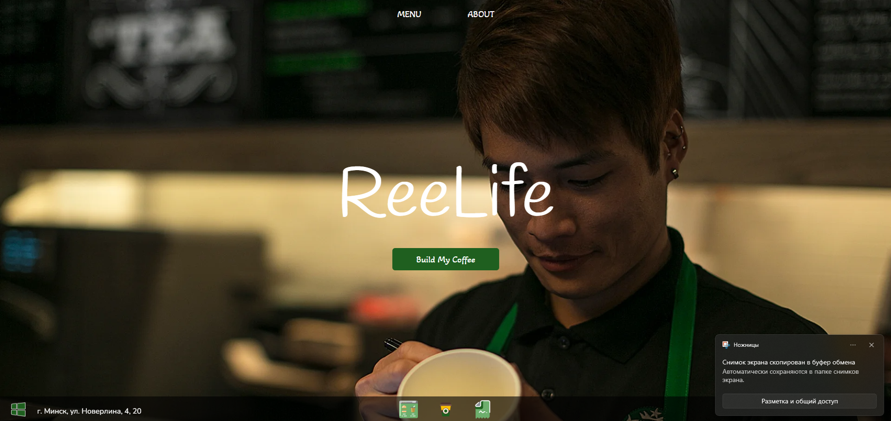
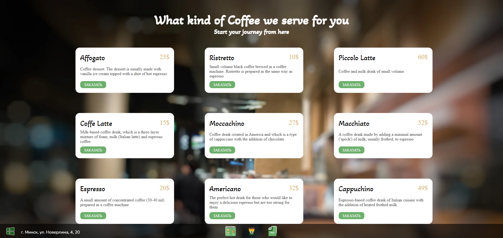
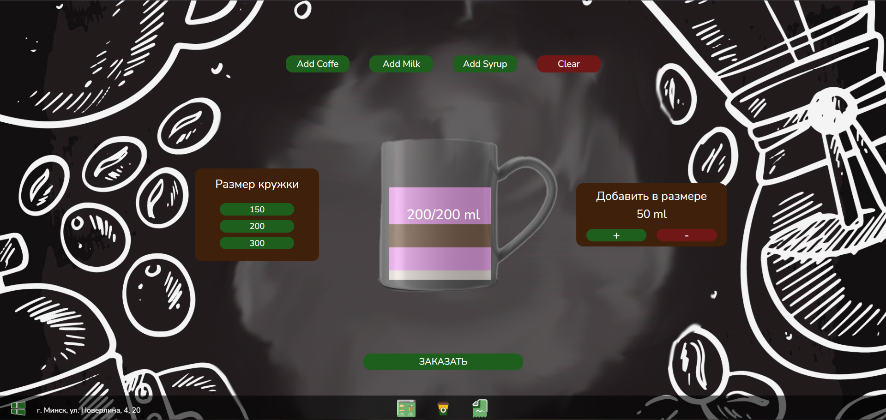
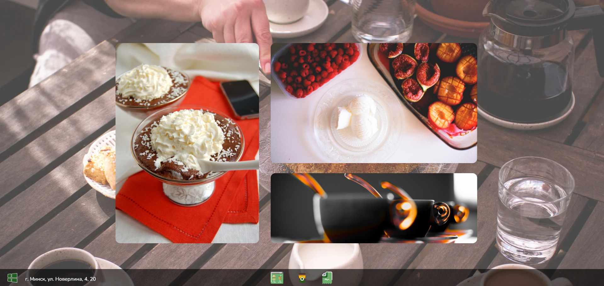
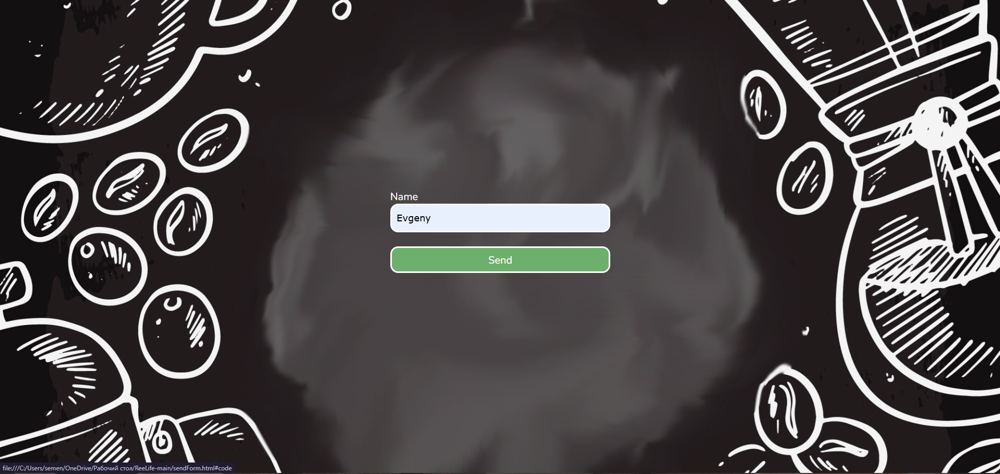

## 🌐 Языки / Languages

- 🇷🇺 [Русский](README.ru.md)

# ☕ ReeLife — Coffee Ordering Website

Welcome to CoffeeOrder — a convenient and stylish site where you can choose a ready-made drink or build your perfect coffee from scratch. This project is designed to simplify interaction between customers and baristas.

## 📄 Description

CoffeeOrder is a single-page application with multiple sections:

### 🧭 Structure of `index.html`

1. **Landing Screen**  
   A welcome screen with a button to proceed to drink selection.

2. **Ready-Made Coffee Options**  
   Quick selection of popular drinks: cappuccino, latte, espresso, and more.

3. **Coffee Constructor**  
   Features:
   - Choose a base (coffee)
   - Add syrup, milk
   - Customize cup size
   - Select number of add-ons

4. **Coffee Shop Gallery**  
   Photos of the interior, atmosphere, and drinks.

### 📝 Order Submission Page

- Enter your name
- Receive a unique order code
- The code is added to the barista admin panel

### 🧑‍🍳 Barista Admin Panel

- View orders with ingredients
- Option to delete completed orders

## 🛠️ Technologies

- HTML, CSS, JavaScript, PHP
- Local storage or mock server
- Responsive layout

## 📸 Screenshots

Below is an example of the site interface:

### 🖼️ Landing Screen

### 🖼️ Coffee

### 🖼️ Coffee Constructor

### 🖼️ Photos

### 🖼️ Order Submission

### 🖼️ Order Code

